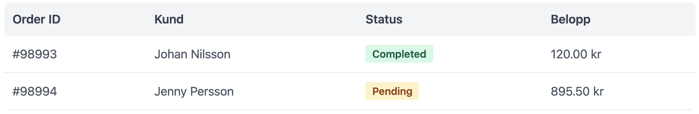
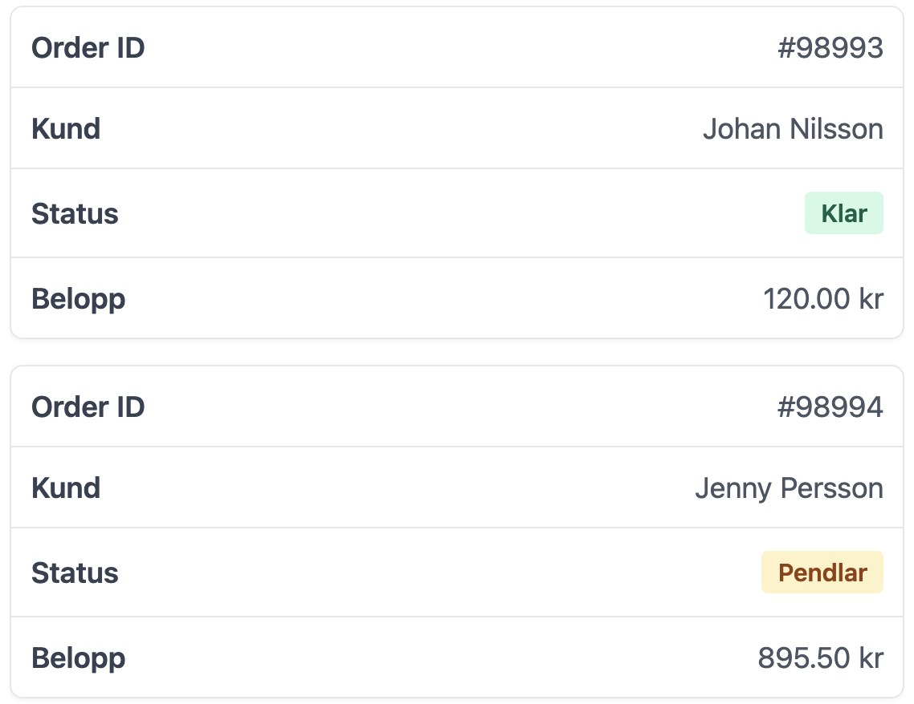

# HTML och CSS Baserad Order Tabell Med Brytning Utan JS
På Desktop visas det som en normal tabell men på tablet / mobil så bryts tabellen ner som separata order uppgifter - helt utan JavaSctipt.

Se bilder för info.

**Desktop**


**Mobil**


## CSS Kod

Implementera direkt utan ändring då unika klassnamn används.

```css
:root {
  --color-bg-muted: #f3f4f6;
  --color-bg-hover: #f9fafb;
  --color-border: #e5e7eb;
  --color-text-main: #374151;
  --color-text-muted: #4b5563;
  --radius-md: 8px;
  --radius-sm: 4px;
  --transition: 0.2s ease;
}
.tabell-omslag {
  font-family: system-ui, sans-serif;
  overflow-x: auto;
  border-radius: var(--radius-md);
  & .mobilanpassad-tabell {
    width: 100%;
    border-collapse: collapse;
    background: white;
    & th {
      background: var(--color-bg-muted);
      padding: 14px 12px;
      text-align: start;
      font-weight: 600;
      color: var(--color-text-main);
      white-space: nowrap;
    }
    & td {
      padding: 14px 12px;
      border-block-end: 1px solid var(--color-border);
      color: var(--color-text-muted);
      white-space: nowrap;
      transition: background var(--transition);
    }
    & tbody tr {
      transition: background var(--transition);
      cursor: default;
      &:hover {
        background-color: var(--color-bg-hover);
      }}}}
.status-markor {
  padding: 4px 10px;
  border-radius: var(--radius-sm);
  font-size: 0.85rem;
  font-weight: 600;
  display: inline-block;
  &.klar { background: #d1fae5; color: #065f46; }
  &.vantande { background: #fef3c7; color: #92400e; }
}
@media (max-width: 600px) {
  .mobilanpassad-tabell {
    & thead { display: none; }    
    & tr {
      display: block;
      margin-block-end: 16px;
      border: 1px solid var(--color-border);
      border-radius: var(--radius-md);
      box-shadow: 0 1px 3px rgba(0,0,0,0.05);
      &:hover { background-color: transparent; }
    }
    & td {
      display: flex;
      justify-content: space-between;
      align-items: center;
      padding-inline: 16px;
      border-block-end: 1px solid #f9fafb;
      white-space: normal;
      &::before {
        content: attr(data-label);
        font-weight: 600;
        color: var(--color-text-main);
        padding-inline-end: 10px;
      }
      &:last-child { border: none; }
    }}}
```

## HTML kod Demo
Använd som den är, men i produktion krävs naturligtvis att du pekar varje uppgift osv.

```html
<div class="tabell-omslag">
  <table class="mobilanpassad-tabell">
    <thead>
      <tr>
        <th>Order ID</th>
        <th>Kund</th>
        <th>Status</th>
        <th>Belopp</th>
      </tr>
    </thead>
    <tbody>
      <tr>
        <td data-label="Order ID">#98993</td>
        <td data-label="Kund">Johan Nilsson</td>
        <td data-label="Status"><span class="status-markor klar">Completed</span></td>
        <td data-label="Belopp">120.00 kr</td>
      </tr>
      <tr>
        <td data-label="Order ID">#98994</td>
        <td data-label="Kund">Jenny Persson</td>
        <td data-label="Status"><span class="status-markor vantande">Pending</span></td>
        <td data-label="Belopp">895.50 kr</td>
      </tr>
    </tbody>
  </table>
</div>
```

Vid frågor, skicka mejl till projektnano.xyz@pproton.me
